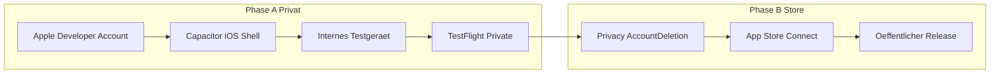

# Kellerkraft — iPhone Private RC (TestFlight), später App Store

**Ziel jetzt:** Privater Release für die Keller-Gruppe via **TestFlight**.  
**Ziel später:** Öffentlicher App-Store-Eintrag.  
**Stand der App:** Vanilla-Web-PWA (HTML/CSS/JS + Firebase), deployt über GitHub Pages. Kein natives iOS-Projekt.

Reine PWAs können **nicht** in den App Store. Der pragmatische Weg: bestehende Web-App in einer nativen Hülle (**Capacitor**) laden und als iOS-App bauen.

---

## Phase 0 — Voraussetzungen (ohne Code)

| Schritt | Was | Warum |
|--------|-----|--------|
| 0.1 | **Apple Developer Program** anmelden (99 $/Jahr, Einzelperson reicht) | Ohne Account kein Signing, kein TestFlight |
| 0.2 | **Mac mit Xcode** (aktuell genug für iOS 17/18 SDK) oder Mac-CI (z. B. GitHub Actions `macos-latest` / Codemagic) | iOS-Builds brauchen Apple-Toolchain; Linux allein reicht nicht |
| 0.3 | Ein **physisches iPhone** für Smoke-Tests | Simulator deckt Safe Area / Offline / Auth Persistence nur teilweise ab |
| 0.4 | Bundle-ID festlegen, z. B. `de.kellerkraft.app` | Einmalig, später schwer zu ändern |
| 0.5 | App-Name in App Store Connect reservieren: **Kellerkraft** | Frühe Namenssicherung |

**Hinweis:** Solange kein Developer-Account da ist, können Code/Struktur vorbereitet werden; Signieren, Install und TestFlight starten erst danach.

---

## Phase 1 — Capacitor-Hülle um die bestehende App

Ziel: Dieselbe UI und Logik, aber als `.ipa` für iPhone.

### 1.1 Projekt-Scaffold — erledigt unter `native/`

Isoliert von GitHub Pages:

- [`native/`](../native/) mit Capacitor 7, Bundle-ID `de.kellerkraft.app`
- [`native/scripts/sync-web.mjs`](../native/scripts/sync-web.mjs) kopiert Root → `native/www` (generiert, gitignore)
- [`native/ios/`](../native/ios/) Xcode-Projekt (Build/Signing nur auf dem Mac)
- Shared Guard: [`js/offline.js`](../js/offline.js) registriert den Service Worker **nicht** in Capacitor; Web-PWA unverändert

Nach Web-Änderungen auf dem Mac: `cd native && npm run sync:ios`.

**Besonderheit dieses Repos:** Kein Bundler, CDN-Imports (Firebase, Chart.js). Für Capacitor vorerst CDN belassen (Netz beim ersten Start). Später: lokal vendoring für Offline-Keller.

### 1.2 Capacitor-Config (Kernpunkte)

- `appId`: Bundle-ID aus Phase 0  
- `appName`: Kellerkraft  
- `webDir`: statischer Output  
- iOS: Content-Security / ATS erlauben für:
  - `*.firebaseio.com` / `*.firebasedatabase.app`
  - `*.googleapis.com` / `gstatic.com` (falls CDN bleibt)
  - ggf. `fonts.googleapis.com` / `fonts.gstatic.com`
- Status Bar / Safe Area: `@capacitor/status-bar` + bestehende `viewport-fit=cover` / `env(safe-area-inset-*)` in [`css/styles.css`](../css/styles.css) und [`index.html`](../index.html) weiter nutzen

### 1.3 Service Worker unter iOS-WebView

In WKWebView (Capacitor) verhalten sich Service Worker **anders / eingeschränkt** als in Safari-PWA.

**RC-Empfehlung:**

- In der nativen App SW-Registrierung in [`js/offline.js`](../js/offline.js) **überspringen**, wenn `Capacitor.isNativePlatform()`.
- Offline weiter über **IndexedDB-Queue** (bereits vorhanden) + gebündelte lokalen Assets.
- Optional später: Capacitor-Filesystem / Network-Plugin für robustere Sync-Hinweise.

### 1.4 Firebase Auth in der Shell

Aktuell: Web-Auth mit `browserLocalPersistence` in [`js/auth.js`](../js/auth.js).

Für den privaten RC prüfen/fixifizieren:

- Login E-Mail/Passwort + anonymer Gast in Capacitor-WebView
- Session bleibt nach App-Kill erhalten
- In Firebase Console: iOS-App hinzufügen (Bundle-ID), ggf. Web-API-Key bleibt für Web-Config nutzbar
- Deep Links / Auth-Redirects: bei reinem E-Mail/Passwort meist unkritisch (kein OAuth nötig für RC)

---

## Phase 2 — iPhone-Kompatibilität (Produkt-QA vor RC)

Manuelle Checkliste auf einem echten iPhone (Capacitor-Build oder vorübergehend Safari; **verbindlich** erst der native Build):

### UI / Gerät

- [ ] Notch / Dynamic Island: Logo und Header nicht unter Statusbar ([`ios-standalone` / Safe-Area-Fallbacks](../index.html))
- [ ] Home-Indicator: Bottom-Nav und CTAs nicht verdeckt
- [ ] Landscape: bewusst sperren (`UISupportedInterfaceOrientations` = Portrait) oder Layout prüfen
- [ ] Dark/Light Theme + Statusbar-Farbe
- [ ] Tastatur: Login-Felder nicht von Keyboard verdeckt (Scroll / `visualViewport`)
- [ ] Touch-Ziele mind. ~44 pt; kein Hover-only

### Kernflows (Kellerkraft)

- [ ] Gast Check-in ohne Login
- [ ] Registrierung / Login E-Mail+Passwort
- [ ] Training starten, loggen, abbrechen
- [ ] Offline: Training erzeugen/loggen ohne Netz, Sync nach Reconnect ([`js/offline.js`](../js/offline.js))
- [ ] Profil, Wochenziel, Streaks, Feed
- [ ] Owner-Ansichten nur mit Rolle (falls relevant für Tester)

### Performance / Assets

- [ ] Übungsmedien und Icons laden lokal oder gecacht
- [ ] Chart.js-Auswertungen ohne Crash
- [ ] Kalter Start unter ~3 s auf mittlerem Gerät (Richtwert)

---

## Phase 3 — Privater Release Candidate (TestFlight)

### 3.1 Signing & App Store Connect

1. Im Developer Portal: App-ID (Bundle-ID), Development + Distribution Certificates, Profiles
2. App Store Connect: neue App anlegen (noch nicht „Submit for Review“ für Public)
3. Xcode / `xcodebuild` / Fastlane: Archive → Upload

### 3.2 TestFlight intern

1. **Internal Testing**-Gruppe (bis 100 Nutzer mit Rollen im Team) — ideal für die Keller-Gruppe, wenn alle Apple-IDs im Developer-Team sind  
2. Oder **External Testing** mit kleinem Invite-Kreis (Apple-Beta-Review einmalig, aber weiterhin „privat“ per Link/Einladung, nicht öffentlich im Store)
3. Build als **RC1** versionieren: z. B. Marketing `1.0.0`, Build `1` (danach streng erhöhen)
4. Kurze **What to Test**-Notes: Login, Training offline, Sync

### 3.3 Mindest-Metadaten schon für TestFlight External

- App-Icon 1024×1024 (kein Alpha)
- Privacy Nutrition Labels (Firebase Auth + Realtime DB = Daten mit Nutzer verknüpft)
- Kurze Beschreibung für Tester

**Noch nicht nötig für rein internes TestFlight:** Screenshots aller Größen, Marketing-Text, öffentliche Privacy-Policy-URL — das kommt in Phase 5. Für External Testing verlangt Apple oft schon Privacy-Angaben.

---

## Phase 4 — Engineering-Backlog für den ersten RC-Build

Priorisiert, was im Repo umgesetzt werden sollte, sobald Account + Mac verfügbar sind:

| Prio | Arbeit | Bezug |
|------|--------|--------|
| ~~P0~~ | ~~Capacitor-Scaffold + `ios/` + Sync-Skript~~ | erledigt in `native/` |
| ~~P0~~ | ~~Native-Detection: SW nur im Browser, nicht in Capacitor~~ | erledigt in `js/offline.js` |
| P0 | CDN-Abhängigkeiten lokal vendoring (Firebase, Chart.js, Fonts optional) | Offline-Keller |
| P0 | Auf dem Mac: CocoaPods (`pod install`), Signing, USB-Deploy | Phase 3 |
| P1 | Portrait-Lock, Splash Screen, App-Icon-Assets für iOS | Store/TestFlight Look |
| P1 | ATS / Allowlist für Firebase-Hosts | Netzwerk |
| P1 | Smoke-Test-Skript / Checkliste aus Phase 2 im Repo halten | QA |
| P2 | Fastlane (`beta` Lane → TestFlight) | Wiederholbare RC-Builds |
| P2 | CI auf macOS für `cap sync` + Archive (optional) | Weniger manuelles Xcode |

**Nicht im ersten privaten RC nötig:** Push-Notifications, Sign in with Apple (nur Pflicht bei Drittanbieter-Social-Login), iPad-Multitasking, Widget.

---

## Phase 5 — Später: öffentlicher App Store (Vorbereitung parallel denkbar)

Wenn der private RC stabil ist:

1. **Account-Löschung** in der App (Apple-Pflicht bei Account-Erstellung) — UI + Backend (Firebase Auth `deleteUser` + RTDB-Userdaten)
2. Öffentliche **Datenschutzerklärung** (URL) — Auth, Trainingslogs, Geräte/Offline-Speicher
3. **Support-URL** / Impressum-Kontakt
4. Screenshots iPhone 6.7" und 6.1" (echte Flows, keine Platzhalter)
5. Altersfreigabe, Kategorie (Health & Fitness / Lifestyle)
6. Review-Notes: Testaccount für Apple Reviewer
7. Submit → Review → Release (manuell oder automatisch nach Approve)

---

## Empfohlene Reihenfolge (kurz)

1. Apple Developer Account beantragen (Freischaltung kann dauern).  
2. Parallel: Capacitor-Scaffold + lokales Vendoring + SW-Guard vorbereiten.  
3. Ersten Debug-Build auf eigenes iPhone (USB / Development Profile).  
4. Phase-2-Checkliste abarbeiten, Bugs fixen.  
5. Archive → TestFlight Internal → Keller-Gruppe.  
6. Nach stabilen RC-Builds: Phase-5-Punkte für öffentlichen Store.

---

## Risiken / Stolpersteine

| Risiko | Mitigation |
|--------|------------|
| Kein Mac im Team | MacStadium / GitHub Actions macos / Codemagic; oder einmalig geliehenes MacBook für Archive |
| SW offline nur in Safari-PWA gedacht | In Native SW aus, Assets bundlen, IDB behalten |
| Firebase CDN offline | Vendor-Kopien im `webDir` |
| Account noch nicht aktiv | Code vorbereiten, Signing/TestFlight blockiert bis Aktivierung |
| Später Store-Reject wegen fehlender Account-Löschung | Früh einplanen, nicht erst am Submit-Tag |

---

## Abgrenzung

- **GitHub-Pages-PWA** bleibt für Browser/Homescreen bestehen; Capacitor ist eine zusätzliche Verteilungs-Schiene.  
- Kein Rewrite in Swift/React Native für den ersten RC.  
- Android/Play Store ist bewusst out of scope für diesen Plan.
